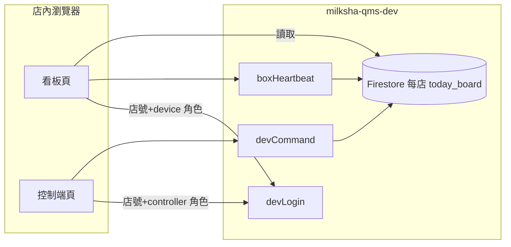

# 每店專屬看板網址規劃（milksha-qms-dev）

## 五句摘要

1. 建議用網址參數 `?store=店號` 指定門市，不改成路徑，以配合 GitHub Pages 靜態網站。
2. 正式給店的連結必帶店號；無店號的舊網址仍預設 `s120030` 測試店，避免書籤失效。
3. 雲端不允許的店號：客人看板維持原畫面；控制端顯示錯誤；後端白名單決定哪些店能連線。
4. 同一店多台看板用 `?device=` 區分；清單與凌晨三點換日清空本來就按店號分開。
5. 防他人改店號主要靠雲端白名單與控制端權限，不是藏網址。

---

## 名詞說明（第一次出現）

- **看板**：客人看到的叫號大螢幕頁面（示範站根目錄 `https://ultronservice.github.io/milksha-demo/`）。
- **控制端**：店員測試送號的網頁（`/controller/`）。
- **店號（storeId）**：例如 `s120030`，代表一家門市。
- **裝置編號（deviceId）**：例如 `stb-01`，代表該店的一台看板裝置。
- **雲端**：Firebase 測試專案 `milksha-qms-dev`（函式區域 asia-east1）。
- **devLogin**：看板或控制端向雲端登入的 API，帶店號、角色（device 或 controller）、裝置編號。
- **GitHub Pages**：把此 repo 發布成靜態網站，沒有後端路由程式。

---

## 現況（簡述）

1. 所有人開同一個看板網址時，若未帶參數，程式預設店號 `s120030`、裝置 `stb-01`。
2. 看板第一次連上雲端會登入並送 **boxHeartbeat**（心跳），在雲端登記裝置。
3. 控制端用 **devCommand**（例如 `push_numbers`、`clear_now`）指定 `{ storeId, deviceId }` 送號或清空。
4. 雲端測試環境只允許店號 `s120030` 或以 `zz-qa-` 開頭的 QA 店；其他店 **devLogin** 回 **403 store_not_allowed**。
5. 本機連線模式用瀏覽器 **localStorage**（本機儲存）在同電腦同步看板與控制端。

---

## 問題與建議

### 1. 網址用參數還是路徑？

**建議：用查詢參數 `?store=店號`（可再加 `&device=裝置編號`），不要用 `/店號/` 路徑。**

| 方式 | 優點 | 缺點 |
|------|------|------|
| `?store=` | 與現有 `receiver-demo`、`controller` 一致；GitHub Pages 不必為每店建資料夾；同一份 HTML 快取可共用 | 店號會出現在網址列，易被複製修改 |
| `/s120030/` 路徑 | 網址較「好看」 | Pages 無伺服器路由，需 `404.html` 轉址或每店複製頁面；舊書籤與 CDN 快取較難維護 |

補充：示範站目前沒有 `404.html`；若改路徑，深層連結容易出現 GitHub 404 頁。

### 2. 網址沒有店號時怎麼做？

**建議：分兩種情境。**

1. **對外正式給店的連結**：一律印帶 `?store=` 的完整網址（控制端產 QR 時也要一致）。
2. **無參數的舊連結**（例如現有示範站根網址）：**繼續預設 `s120030`**，讓測試書籤與文件不用立刻改。

若負責人希望「沒店號就禁止連雲端」，可改為顯示簡短設定錯誤（僅員工看得懂），但會打破現有根網址行為。

### 3. 店號錯誤或雲端不允許時，看板顯示什麼？

**建議：維持「客人無感」原則，並加強員工可發現的提示（可選）。**

- **雲端 403（store_not_allowed）**：現行程式對客人**不顯示**錯誤、**不清空**已顯示號碼；停止上傳與心跳，約每 5 分鐘重試登入。
- **店號格式明顯錯誤**（未來可加檢查）：可在載入時顯示「店號無效」，避免誤以為已連線。
- **控制端**：已會顯示粉紅提示（店未開放等），應保留。

### 4. 雲端允許哪些店？

**建議：測試階段延續「雲端白名單」；新開店由後端在 milksha-cloud 加入店號，前端店單與白名單同步。**

- 現況：硬編碼允許 `s120030` 與 `zz-qa-*`（假雲端與正式規則一致）。
- 控制端 UI 已有三家店的**展示用**清單（含尚未開雲端的 `s110012` 等）；送雲端指令時，未開放店會 403。
- **不建議**只靠前端下拉選單當安全邊界；**以雲端白名單為準**。
- 長期可改為 Firestore「允許店清單」由管理員新增，但本規劃範圍僅 dev 專案，可先維持設定檔白名單。

### 5. 同一店多台看板，裝置編號怎麼分？

**建議：一台螢幕一個 `deviceId`，寫進該店專屬網址 `&device=stb-02`。**

1. 第一台預設 `stb-01`（與現況相同）。
2. 第二台起用 `stb-02`、`stb-03`…（須符合英數與 `-_.` 格式）。
3. 兩台用同一 `deviceId` 會共用雲端同一裝置文件，**devCommand** 只會驅動其中一台的指令佇列，且心跳互相覆寫 → 應視為設定錯誤。
4. 可選：首次開機若未帶 `device`，提示店員掃控制端 QR（已含 device）或手動選編號。

### 6. 如何防止有人改網址店號偷看或干擾別店？

**建議：接受「網址不是密碼」；用雲端白名單 + 角色權限降低風險。**

1. **看別店**：只有白名單內的店能 **devLogin**；未開放店無法同步資料（403）。已開放店之間，知道店號的人理論上可開看板 URL，但看不到 POS 真實送號（除非另有入口）。
2. **干擾別店**：**devCommand** 需控制端以 **controller** 角色登入該店；應在 milksha-cloud 驗證 token 與店號一致。測試環境仍應避免把控制端連結公開到網路上。
3. **不建議**只靠前端隱藏店號；正式環境需裝置 token 或店內網（本規劃列為日後、非本次 dev 範圍）。
4. **POS 簽章金鑰**只存控制端本機，不放在看板網址（現況已如此）。

### 7. 凌晨三點自動清空與「清空看板」要不要按店？

**建議：是，且資料模型已是按店；實作上確認「指令與營業日」都帶正確店號即可。**

- **營業日**：台北時間每日 **03:00** 換日；各店 `today_board` 文件獨立，讀取時若營業日過期會清空該店票號。
- **「清空看板」按鈕**：送 `clear_now` 到目前控制端選定的 `storeId` + `deviceId`；已是每店每裝置。
- 注意：自動清空是「該店看板文件」層級，不是全專案一鍵清空。

### 8. 如何保留 `s120030` 測試網址？

**建議：**

1. 根網址 `https://ultronservice.github.io/milksha-demo/` **不帶參數**時，行為與今天相同（`s120030` + `stb-01` + 內建雲端模式）。
2. 明確測試用可繼續使用 `?store=s120030&device=stb-01`。
3. 文件與 QR 產生器改為「正式店帶店號；測試店可省略參數」。
4. **規劃與驗證時不要對 s120030 執行 devCommand 寫入**（依本次任務要求）。

---

## 要負責人決定的事

| 決策 | 選項 | 建議 |
|------|------|------|
| A. 無店號的看板網址 | (1) 繼續預設 s120030 (2) 顯示錯誤、不連雲端 (3) 顯示店號選擇頁 | **(1)** |
| B. 看板正式網址用哪一頁 | (1) 根目錄看板 (2) `receiver-demo/` (3) 兩者並存、QR 只發一種 | **(1)**，並更新控制端產生的 QR 連結 |
| C. 新店上線流程 | (1) 後端改白名單後再發 URL (2) 前端先加下拉、後端稍後 (3) 管理後台自助加店 | **(1)**（dev 期最簡） |
| D. 403 時客人是否完全無提示 | (1) 完全無提示 (2) 角落小字「連線暫停」僅員工訓練用 | **(1)** |
| E. 多台看板預設 device | (1) 全店共用 stb-01 直到改 URL (2) 強制每台 QR 含不同 device | **(2)** |
| F. 控制端店單來源 | (1) 固定三家示範 (2) 與雲端白名單同步 (3) 手動輸入店號 | **(2)** 中期；(1) 短期可接受 |

---

## 各端要改什麼（白話、不寫程式）

### 看板（board）

1. 啟動時**以網址 `store` 為準**寫入連線身分；根網址無參數時保留 s120030 預設。
2. 雲端模式下，**localStorage 快取鍵**已含店號；換店號時應避免讀到舊店快取（必要時依店號隔離或首次強制重登）。
3. 控制端產生的「看板連結／QR」應指向**根看板**並帶 `store`（與 `device`），不要只指向 `receiver-demo`（除非決策 B 選 2）。
4. 可選：店號缺失或非法時，顯示員工用錯誤卡（不影響已連線客人的 403 行為）。

### 控制端（controller）

1. 網址支援 `?store=` 預選門市（已有）；連線與送號一律用表單店號。
2. 店下拉選單與雲端允許清單對齊，避免選到必 403 的店卻以為系統故障。
3. 「產生看板連結／QR」模板改為每店每裝置唯一 URL。
4. 本機測試模式保留：同瀏覽器多店時仍用 localStorage 協調（現有「店號不同請重整看板」提示）。

### 雲端（milksha-cloud，milksha-qms-dev）

1. **devLogin** 白名單新增正式試點店號（維持 `zz-qa-*` 給自動測試）。
2. 確認 **devCommand** 僅 **controller** 角色可對該 `storeId` 下指令；**device** 角色不能代發指令。
3. Firestore 路徑已是 `stores/{storeId}/...`，無需為「每店 URL」改結構；僅確保新店有初始文件或首次心跳建立裝置。
4. CORS 已允許 `ultronservice.github.io`（維持即可）。

---

## 工作量與風險（以代理實作為單位）

| 部分 | 粗估 | 主要風險 |
|------|------|----------|
| 看板：店號解析、快取隔離、錯誤 UI | 4–8 小時 | 換店號後仍顯示舊店資料；需回歸測試 |
| 控制端：QR／連結、店單同步 | 3–6 小時 | QR 指錯頁面導致現場開錯站 |
| 雲端：白名單擴店、權限複查 | 2–4 小時（後端 repo） | 與前端店單不一致造成 403 困惑 |
| 自動測試／E2E 更新 | 4–8 小時 | GitHub Pages 與假雲端行為差異 |
| **合計** | **約 2–3 個工作天** | 測試店 s120030 與多店並行時誤操作 devCommand |

---

## 驗收步驟（UAT，給非工程背景）

1. 向技術取得「店 A」的完整看板網址（含 `?store=` 與 `&device=`）。
2. 用手機或電腦瀏覽器開啟該網址，確認看板正常顯示（可取餐／製作中區塊存在）。
3. 開控制端 `https://ultronservice.github.io/milksha-demo/controller/?store=店A店號`，選雲端模式並連線。
4. 在控制端送一組測試號碼，確認**只有店 A 看板**出現該號碼。
5. 把看板網址的店號改成未開放店，確認看板**不崩潰**；控制端對未開放店應出現**無權限類提示**。
6. 開啟舊的根網址（無參數），確認仍為 **s120030** 測試行為。
7. 按「清空看板」，確認僅該店看板號碼被清掉。

---

## 附錄：程式依據（簡表）

| 主題 | 位置 |
|------|------|
| 看板預設店號／home 行為 | `js/receiver/cloud-boot.js` `readCreds` |
| 本機 POC 預設 s120030 | `js/transport/local-poc-coord.js` |
| 控制端店號預設與 URL `store` | `controller/controller-app.js` |
| 示範店清單（三家） | `js/receiver/validate-request.js` `STORES` |
| dev 白名單（假雲端） | `tools/fake-cloud/server.mjs` `isAllowedDevLoginStore` |
| 403 看板客人無感 | `js/receiver/cloud-boot.js` `handleAuthFailure`；`docs/OWNER-TRIAL.md` |
| 每店 Firestore 路徑 | `js/transport/paths.js` |
| 營業日 03:00 | `js/board/today-board.js` |
| Pages 內建 milksha-qms-dev | `config/firebase.js` |
| 控制端看板 QR（目前 receiver-demo） | `controller/controller-app.js` `updateBoardLinks` |

---

## PR 摘要草稿（實作階段用）

- **變更內容**：每店看板與控制端以 `?store=`（及 `device`）區分；同步 QR、白名單與快取隔離；保留無參數 s120030。
- **原因**：避免所有門市共用同一 URL 都連到測試店。
- **手動測試**：見上方 UAT 七步。
